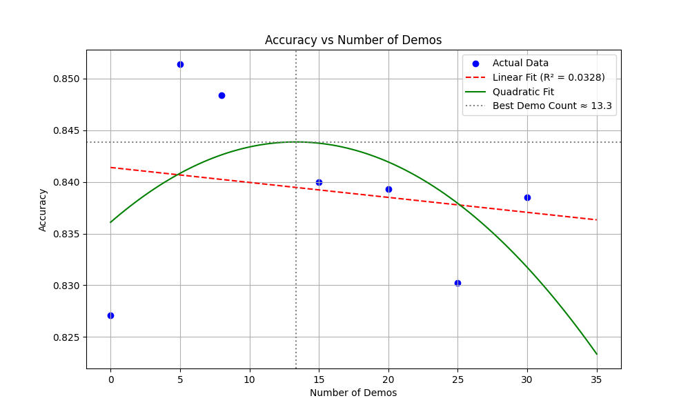

# COMP7607 Assignment 2 Report

**Jiang Feiyu 3035770800**

<div STYLE="page-break-after: always;"></div>

## Structure of the directory
```
│  Assignment_2_COMP7607_2024.pdf
│  README.md
│  report_3035770800.pdf
│  
├─output
│      few_shot_baseline.jsonl
│      few_shot_prompt_com_complex_demo.jsonl
│      few_shot_prompt_com_simplified_demo.jsonl
│      few_shot_prompt_div_differ_structure.jsonl
│      few_shot_prompt_div_diver_style.jsonl
│      few_shot_prompt_div_varied_instrc.jsonl
│      few_shot_prompt_num_15.jsonl
│      few_shot_prompt_num_20.jsonl
│      few_shot_prompt_num_25.jsonl
│      few_shot_prompt_num_30.jsonl
│      few_shot_prompt_num_5.jsonl
│      few_shot_prompt_qua_correctdemo_norelat_qes.jsonl
│      few_shot_prompt_qua_correctdemo_wrongans.jsonl
│      few_shot_prompt_qua_wrong_demo.jsonl
│
├─prompt
│      few_shot_prompt.json
│      few_shot_prompt_com_complex_demo.json
│      few_shot_prompt_com_simplified_demo.json
│      few_shot_prompt_div_differ_structure.json
│      few_shot_prompt_div_diver_style.json
│      few_shot_prompt_div_varied_instrc.json
│      few_shot_prompt_num_15.json
│      few_shot_prompt_num_20.json
│      few_shot_prompt_num_25.json
│      few_shot_prompt_num_30.json
│      few_shot_prompt_num_5.json
│      few_shot_prompt_qua_correctdemo_norelat_qes.json
│      few_shot_prompt_qua_correctdemo_wrongans.json
│      few_shot_prompt_qua_wrong_demo.json
│
├─SambaNova
│      test_full_response.py
│
├─src
│      demo_num_accuracy.png
│
└─test
        plot.py
        test.py
```

`./test` concludes all codes for testing, while `./prompt` concludes all the origin prompt for reference. The result of the test has been stored into the `./output` directory.

<div STYLE="page-break-after: always;"></div>

## Introduction

Large Language Models (LLMs) have demonstrated remarkable capabilities across various tasks, yet their performance can be significantly influenced by how we communicate with them. Prompt engineering, which involves crafting effective instructions for LLMs without modifying their underlying parameters, has emerged as a crucial technique for optimizing model outputs.

In this report, the investigation focuses on three critical dimensions that influence LLM performance:

First, this report examines prompt quality and its impact on model responses. This includes analyzing how well-structured and poorly-structured prompts affect the accuracy and consistency of LLM outputs. Second, this report investigates the role of demonstration quantity, studying how the number of examples provided in prompts influences the model's understanding and performance. Third, this report explores prompt diversity to understand how varying the types and patterns of examples affects the model's ability to generalize across different problem scenarios.

This research aims to provide empirical insights into the relationship between prompt characteristics and LLM performance, contributing to our understanding of effective prompt engineering strategies. The findings from this study have practical implications for optimizing LLM interactions across various applications, from educational tools to automated problem-solving systems.

#### Model

`Meta-Llama-3.1-8B-Instruct`

    temperature=0.1,
    top_p=0.2,

#### Dataset

`GSM8K`

<div STYLE="page-break-after: always;"></div>

## Prompt Quality

### Few-Shot Baseline

In the few-shot baseline, I give LLM with 8 standard & correct questions & answers as prompt for AI to reference. One sample is:

        {
            "role": "user",
            "content": "Question: There are 15 trees in the grove. Grove workers will plant trees in the grove today. After they are done, there will be 21 trees. How many trees did the grove workers plant today?"
        },
        {
            "role": "assistant",
            "content": "Answer:\nLet's think step by step.\nThere are 15 trees originally. Then there were 21 trees after the Grove workers planted some more. So there must have been 21 + 15 = <<21+15=36>>36 trees that were planted.\n#### 36"
        }

The Accuracy of this few-shot baseline is: `0.848369977` (1119/1319)

### Few-Showt Prompt with Correct solution steps & incorrect answers

Modified based on the few-shot baseline, I modified the correct answer to wrong answers, but the solution steps are correct. For example:

         {
            "role": "user",
            "content": "Question: Olivia has $23. She bought five bagels for $3 each. How much money does she have left?"
        },
        {
            "role": "assistant",
            "content": "Answer:\nLet's think step by step.\nOlivia had 23 dollars. She bought 5 bagels for 3 dollars each. So she spent 5 * 3 = <<5*3=15>>15 dollars. Now she has 23 - 15 = <<23-15=4>>4 dollars left.\n#### 4"
        }

The Accuracy of this method is: `0.8468536770280516 ` (1117/1319)

### Few-Showt Prompt with Correct Solution but not Related to Question

The solutions have been modified from the few-shot baseline to maintain logical consistency within their steps while intentionally misaligning with the questions' requirements. Though the mathematical reasoning appears sound, the chosen operations and calculations do not correspond to what the questions actually ask for. For example:

        {
            "role": "user",
            "content": "Question: Olivia has $23. She bought five bagels for $3 each. How much money does she have left?"
        },
        {
            "role": "assistant",
            "content": "Answer:\nLet's think step by step.\nThere are 15 trees originally. Then there were 21 trees after the Grove workers planted some more. So there must have been 21 - 15 = <<21-15=6>>6 trees that were planted.\n#### 6"
        },

The Accuracy of this method is: `0.5231235784685367` (690/1319)

### Few-Showt Prompt with Wrong Solution and Wrong Answers

The solutions have been modified from the few-shot baseline by deliberately altering the mathematical operations, such as replacing addition with multiplication or subtraction. Both the solution steps and final answers are intentionally incorrect. For example:

        {
            "role": "user",
            "content": "Question: Elsa has 5 apples. Anna has 2 more apples than Elsa. How many apples do they have together?"
        },
        {
            "role": "assistant",
            "content": "Answer:\nLet's think step by step.\nElsa has 5 apples. Anna has 2 more than Elsa, so Anna has 5 * 2 = <<5*2=10>>10 apples. Together they have 5 + 10 = <<5+10=15>>15 apples.\n#### 15"
        }

### Observation

| prompt type                                                        | accuracy |
| ------------------------------------------------------------------ | -------- |
| Few-Shot Baseline                                                  | 0.8484   |
| Few-Showt Prompt with Correct solution steps & incorrect answers   | 0.8469   |
| Few-Showt Prompt with Correct Solution but not Related to Question | 0.5231   |
| Few-Showt Prompt with Wrong Solution and Wrong Answers             | 0.2100   |

The experimental results demonstrate a clear correlation between prompt quality and model accuracy.

1.  Prompts with correct solution steps but incorrect answers maintain nearly equivalent performance (84.69%), showing only a marginal decrease of 0.15 percentage points from the baseline. This suggests that the **model primarily learns from the logical structure of the solution steps rather than the final answers**.

2.  When prompts contain correct solutions that are unrelated to the questions, the accuracy drops significantly to 52.31%，indicating that **alignment between questions and solutions is crucial for model performance**.

3.  The most dramatic impact is observed with prompts containing both wrong solutions and wrong answers, where accuracy plummets to 21.00%. This represents a 63.84 percentage point decrease from the baseline, highlighting that **poor quality prompts with incorrect reasoning severely impair the model's problem-solving capabilities**.

<div STYLE="page-break-after: always;"></div>

## Prompt Complexity

### Simplified Prompt

Only reserve necessary steps and answers.

Main ways to simplify include:

*   Remove specific names of characters (such as Olivia, Elsa, Anna, etc.)
*   Simplify sentence structure and use more concise expressions
*   Remove unnecessary descriptive details
*   Use more direct mathematical language
*   The solution steps are also simplified and use a more concise format

For example:

        {
            "role": "user",
            "content": "Question: Someone has $23 and spends $15 on bagels. How much money is left?"
        },
        {
            "role": "assistant",
            "content": "Answer:\nInitial: $23\nSpent: $15\nRemaining: 23 - 15 = <<23-15=8>>$8\n#### 8"
        }

The Accuracy of this method is: `0.8157695223654283` (1076/1319)

### Complex Prompt

Add more context and details to each problem while keeping the core math problem the same.

Main ways to complicate include:

*   Adding richer background information and scene descriptions
*   Using more formal and detailed language
*   Including environmental details and relevant context
*   Using more complex sentence structures
*   Including character motivations or reasons for their actions
*   The solution steps are also complicated accordingly, using a more detailed analysis format

For example:

    {
            "role": "user",
            "content": "Question: Olivia Chen-Martinez, a third-year biochemistry doctoral candidate at Stanford University, maintains a carefully monitored research budget of $23.00 from her prestigious NSF Graduate Research Fellowship. During a critical phase of her investigation into novel protein folding mechanisms, she visited the university's exclusive Molecular Sciences Café to purchase five artisanal sourdough bagels, each priced at $3.00, enriched with precise quantities of specialized amino acids for her team's controlled dietary intake study. The bagels were specifically crafted by the café's resident culinary scientist, Dr. James Baker, PhD in Food Biochemistry, following strict laboratory-grade preparation protocols. For grant reporting and expense tracking purposes, what remaining amount from her allocated research funds is available for future experimental consumables?"
        },
        {
            "role": "assistant",
            "content": "Answer:\nLet us analyze this research expenditure through systematic financial calculation:\n\n1. Initial Budget Analysis:\n * Available funding: $23.00\n * Source: NSF Graduate Research Fellowship\n * Purpose: Protein folding research\n\n2. Expenditure Calculation:\n * Unit cost: $3.00 per specialized bagel\n * Quantity purchased: 5 units\n * Total expenditure: 5 * $3.00 = <<5*3=15>>$15.00\n\n3. Remaining Budget Determination:\n * Initial budget - Total expenditure\n * Mathematical operation: $23.00 - $15.00 = <<23-15=8>>$8.00\n\n4. Financial Verification:\n * Original budget ($23.00) - Experimental consumables ($15.00) = Available funds ($8.00)\n * Documented for grant reporting purposes\n\n#### 8"
        }

The Accuracy of this method is: `0.7058377558756633` (931/1319)

### Observation

| prompt type       | accuracy |
| ----------------- | -------- |
| Simplified Prompt | 0.8158   |
| Origin Prompt     | 0.8484   |
| Complex Prompt    | 0.7058   |

The original prompts and simplified versions show minimal difference, indicating that **moderate prompt complexity may help improve accuracy**.

Complex prompts show significantly lower performance, suggesting that **excessive complexity in prompts may affect the model's understanding and execution effectiveness**.

## Number of Demonstrations

Here the author hope to explore the effect of increasing the number of demonstrations on accuracy for a fixed task statement.

To explore the linear relationship, I set different numbers of prompts: `0` (zero-shot), `5`, `8` (few-shot), `15`, `20`，`25` and `30` for comparison.

| demo No. | accuracy |
| -------- | -------- |
| 0        | 0.8271   |
| 5        | 0.8514   |
| 8        | 0.8484   |
| 15       | 0.8400   |
| 20       | 0.8393   |
| 25       | 0.8302   |
| 30       | 0.8385   |

Based on this, I used python tools to virtualized the data


Linear Relationship Analysis:

-   The red dashed line represents linear fitting, with a very low R² value of 0.0328
-   This indicates almost no linear relationship between the number of demos and accuracy

Quadratic Fitting Analysis (Green Solid Line):

-   The data better fits a quadratic curve distribution
-   The optimal number of demos is approximately 13.3 (indicated by the gray vertical dotted line)
-   The curve shows a trend of initial increase followed by decrease
    -   Accuracy increases rapidly with 0-5 demos
    -   Maintains high performance between 5-15 demos
    -   Accuracy gradually decreases after 15 demos

### Observation
-   **Recommended to maintain 10-15 demos**
-   Not necessary to provide too many demo examples, **Quality is more important than quantity**

<div STYLE="page-break-after: always;"></div>

## Prompt Diversity
Here the author hope to explore the influence of using different prompt style.
### Different phasing structure
Using different phrasing and sentence/code structures to guide LLMs, avoiding over-reliance on fixed formats.

For example, the origin few-shot prompt is:
```
    {
        "role": "user",
        "content": "Question: {content}"
    },
    {
        "role": "assistant",
        "content": "Answer:\nLet's think step by step.\nT{steps} = <<{answer}>>{answer} {units} \n#### {answer}"
    }
```

Introducing different ways of breaking down solutions while maintaining clarity, including:
- Restructured the system prompt to be more conversational and flexible
- Used more diverse vocabulary and sentence structures
- Maintained the step-by-step logical flow in solutions but with varied presentations

For example:
```
    {
        "role": "user",
        "content": "With $23, Olivia purchases 5 bagels at $3 each. Calculate her remaining money."
    },
    {
        "role": "assistant",
        "content": "Starting amount: $23\nBagel cost: 5 × $3 = <<5*3=15>>$15\nRemaining: $23 - $15 = <<23-15=8>>$8\nSolution:\n#### 8"
    }
```
The Accuracy of this method is: `0.8157695223654283` (1076/1319)

### Varied task instructions
Providing varied task instructions or background information to help the model better understand the task requirements.

For example, the origin few-shot prompt is:
```
    {
        "role": "system",
        "content": "Your task is to solve a series of math word problems by providing the final answer. Use the format #### [value] to highlight your answer. For example, if the answer is 560, you should write #### 560."
    }
```
The improvements include:
- Clarified the role of the assistant (skilled math tutor)
- Provided more detailed instructions for the task steps
- Emphasised the presentation format of the calculation process
- Required to include unit information
- Emphasised accuracy and clear reasoning

```
    {
        "role": "system",
        "content": "You are a skilled math tutor who helps students solve word problems step by step. Your task is to analyze math word problems and provide detailed explanations leading to the final answer.\nWhen solving problems:\n1. Break down the problem into clear logical steps\n2. Show all calculations using the format <<calculation=result>>\n3. Present your final answer in the format #### [value]\nFocus on accuracy and clear reasoning in your explanations.If units are involved (dollars, items, etc.), include them in your answer."
    }
```
The Accuracy of this method is: `0.7634571645185747` (1007/1319)

### Prompts with diverse styles and tones
Here adding different writing styles, for example:
- **formal**
    - Using formal words, like `initiative`
    ```
    The local conservation team has planned a planting initiative for today.
    ```
    
    - Using formal sentence structure
    ```
    By sunset, the grove will proudly host 21 trees.
    ```
    
    - direct declarative sentences
    ```
    Michael's week starts with 58 golf balls.
    ```
- **playful**
    - Add interesting sentences
    ```
    Sweet Challenge
    Let's unravel this nature puzzle!
    Time for some quick calculations!
    Frozen Fruit Fun
    ```
The prompt as a whole tends to use a playful style, making mathematical problems more attractive through interesting titles and expressions, while maintaining a certain degree of formality in the specific problem descriptions to ensure clarity.

The Accuracy of this method is: `0.8119787717968158` (1071/1319)

### Observation

| method | accuracy |
| --- | --- |
| few-shot baseline | 0.8484 |
| prompt with different phasing structure | 0.8158 |
| prompt with varied task instructions | 0.7635 |
| prompt with diverse styles and tones | 0.8120 |

- Baseline performed best, probably because:
    - Simple and direct prompts likely allow the model to focus better on the core task
    -   Fixed formats help the model develop stable problem-solving patterns
    -   Reduces interference and ambiguity from other factors

- For diverse prompt, this may lead accuracy decrease because:
    - Flexible expression patterns may increase complexity in model comprehension and processing; excessive instructions and requirements may disperse the model's attention
    - Diverse formats might obscure key information extraction
    - Detailed explanations actually increase the model's interpretation burden
    - Playful expressions might reduce problem solving rigor

Thus
- For rigorous tasks like mathematical problem-solving, **simple direct prompts may be more effective than complex diverse ones**
- Diversity should be introduced moderately while maintaining clear task focus
- **Excessive format innovation might compromise task accuracy**

<div STYLE="page-break-after: always;"></div>

## Conclusion
This research reveals several key insights into optimizing LLM performance through prompt engineering.

First, model accuracy largely depends on the logical structure of solutions rather than just the final answers.

Second, there is a non-linear relationship between prompt complexity and performance - moderate complexity can be beneficial. The research suggests an optimal range of 10-15 demonstrations. Quality is emphasized over quantity in prompts.

Third, the research finds that overly complex or brief prompts hinder model understanding. The prompts should provide necessary and accurate information without excess.

For mathematical problem-solving, adopting a consistent prompt style and using rigorous prompts helps large models best complete their tasks.
